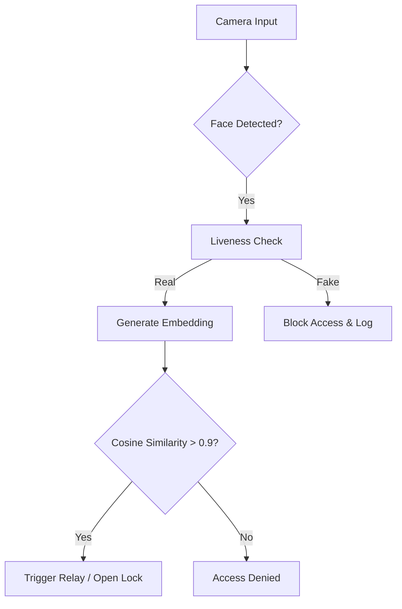

# 🔒 Smart Door Lock: Face Recognition with Anti-Spoofing

  
   
  
  <h3 align="center">Secure Biometric Access Control System</h3>

  

    A robust, edge-based security system running on Raspberry Pi 4, featuring real-time liveness detection (anti-spoofing) and Deep Learning based identification.
     
   
  

---

## 📖 Abstract

This project, developed as a **B.Sc. Graduation Thesis** at **Istanbul Kültür University**, presents a contactless smart door lock system. The system addresses the vulnerability of traditional face recognition to "presentation attacks" (photos/videos) by integrating a lightweight **Liveness Detection** module.

The pipeline leverages **MTCNN** for face alignment and **InceptionResNetV1 (FaceNet)** for generating 512-dimensional embeddings. To optimize performance on the embedded Raspberry Pi 4 CPU, the system employs a multi-threaded architecture, achieving stable real-time verification (~0.7 FPS end-to-end) without external accelerators.

## ✨ Key Features

* **🛡️ Anti-Spoofing (Liveness):** Integrated **TensorFlow Lite** model rejects fake faces (photos, screens) with **96% accuracy**.
* **🧠 Deep Learning Core:** Uses **InceptionResNetV1** pre-trained on VGGFace2 for state-of-the-art recognition accuracy (**96.5%**).
* **⚡ Edge Optimization:** * **Hybrid Detection:** Explored HAAR/HOG for pre-filtering to reduce computational load.
    * **Threading:** Decoupled UI and processing threads (Tkinter GUI) prevent freezing during inference.
* **🔌 Custom Hardware Driver:** MOSFET-based (BS170) driver circuit to safely trigger 5V relays from 3.3V GPIO logic.
* **📊 Robust Logging:** Automated logging of access attempts and unauthorized entries.

## ⚙️ System Architecture

The software pipeline consists of 5 main stages processing frames from the **Pi Camera Module V3**:

1.  **Pre-processing:** Grayscale conversion & Histogram Equalization (CLAHE) for low-light enhancement.
2.  **Detection & Alignment:** **MTCNN** detects facial landmarks (eyes, nose, mouth) and crops the face ($160\times160$ px).
3.  **Liveness Check:** A binary classification model (Real vs. Spoof) verifies the user is a live person.
4.  **Embedding Extraction:** **InceptionResNetV1** converts the face into a 512-D vector.
5.  **Matching:** **Cosine Similarity** calculates the distance between the live vector and the database. (Threshold > 0.90).

## 📐 Similarity Metric: Cosine Similarity

To verify identity, the system compares the live face embedding ($A$) with the stored profile vector ($B$). Instead of measuring Euclidean distance, **Cosine Similarity** is used to measure the cosine of the angle between these two non-zero vectors. This method is mathematically robust against variations in signal magnitude (e.g., changes in lighting intensity), focusing instead on the orientation of the features.

The similarity score is calculated as:

$$S_{c}(A,B) = \frac{A \cdot B}{||A|| ||B||} = \frac{\sum_{i=1}^{n}A_{i}B_{i}}{\sqrt{\sum_{i=1}^{n}A_{i}^{2}}\sqrt{\sum_{i=1}^{n}B_{i}^{2}}}$$

* **Logic:** The resulting score ranges from -1 (exactly opposite) to 1 (exactly the same)[cite: 438].
* **Threshold:** Based on our experimental results, a strict threshold of **0.90** is applied[cite: 581, 846]. Scores above 0.90 are considered a match and trigger the door unlock mechanism.

## 🔌 Circuit Design & Hardware
The system operates as a standalone unit. A custom driver circuit was designed to protect the Raspberry Pi GPIO pins.

| Component | Function |
| :--- | :--- |
| **Raspberry Pi 4 (4GB)** | Main Processing Unit (CPU-based inference) |
| **Pi Camera V3** | High-Res Image Acquisition (IMX219) |
| **BS170 MOSFET** | Signal Switching (3.3V Logic -> 5V Trigger) |
| **5V Relay Module** | Controls the Solenoid Lock |
| **12V Solenoid Lock** | Physical Actuator |

> **Note:** The **BS170 MOSFET** is used in a low-side switching configuration to safely drive the 5V relay coil using the Pi's 3.3V GPIO logic, ensuring signal stability and isolation.

## 📊 Performance Analysis
Extensive testing was conducted under various conditions (1,050 validation tests). Below are the specific results from the thesis:

### 1. Recognition Accuracy vs. Lighting
| Lighting Condition | Lux Level | Accuracy |
| :--- | :--- | :--- |
| **High Light** | 800-1000 lx | **98.6%** |
| **Medium Light** | 300-500 lx | **97.8%** |
| **Low Light** | 100-200 lx | **92.3%** |

### 2. Model Comparison (Embedded Performance)
Comparison of our proposed method against traditional and other CNN baselines on RPi 4:

| Method | Accuracy | Avg. FPS | Notes |
| :--- | :---: | :---: | :--- |
| Haar Cascade + HOG | 88.0% | ~3.5 | Fast but low accuracy |
| VGG16 + SSD300 | 92.0% | ~1.0 | Heavy computational load |
| **MTCNN + InceptionResNetV1** | **96.5%** | **~0.7** | **Best balance of Security/Speed** |

### 3. Liveness Test Results
* **Real Face Acceptance:** 98%
* **Spoof Attack Rejection:** 96% *(Photos/Videos successfully blocked)*
